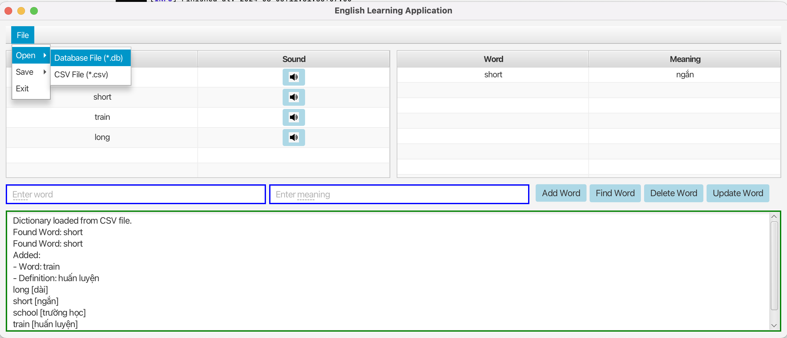

# English Learning Project App



**Author:** Phạm Huy Châu Long - 23021615

## Project Overview

- The English Learning Project App is a Java-based application designed to facilitate the management of an English dictionary. 

## Features

### Core Features

- **Add, Remove, Update, and Find Dictionary Words**:
  - **Add**: Add new words with their definitions.
  - **Remove**: Delete words from the dictionary.
  - **Update**: Modify existing words or their definitions.
  - **Find**: Search for words and view their meanings.

- **Word Suggestion**:
  - Provides real-time suggestions based on user input using the TRIE algorithm, improving the user experience by predicting and recommending words as users type.

- **Data Import/Export**:
  - **CSV Files**: Import and export dictionary data in CSV format, making it easy to share and backup data.
  - **Database**: Load and save dictionary data to/from a database for persistent storage and efficient data management.

- **Google API Integration**:
  - **Translation**: Uses Google Translate API to provide translations for words and phrases.
  - **Voice Pronunciation**: Leverages Google Text-to-Speech API to offer pronunciation guidance for words.

- **Log Area**:
  - Displays system messages, errors, and other logs to provide feedback and track application activities.

### Signature Points

- **TRIE Algorithm**:
  - **Optimized Query**: Enables fast and efficient searching for words and suggestions.
  - **Memory Efficient**: Reduces memory usage compared to other data structures by storing common prefixes once.
  - **Word Suggestions**: Generates relevant word suggestions based on partial input.

- **Database and CSV File Integration**:
  - **Memory Efficient**: Handles large datasets efficiently by using external storage for persistence.
  - **Persistent Storage**: Ensures data is saved between sessions and supports backup and recovery.

- **Google API Integration**:
  - **Translation Support**: Provides automatic translation of words to assist in learning new languages.
  - **Voice Support**: Offers audio pronunciation of words to aid in correct pronunciation.

## Installation and Usage

### Prerequisites

- **Maven**: A build automation tool used for managing project dependencies and building the application.
- **JDK 11 or Higher**: Java Development Kit required to run the application.
- **JavaFX**: JavaFX SDK needed to build and run the graphical user interface.

### Setup

1. **Clone the Repository**:
```bash
$ git clone https://github.com/LongSei/OOP-BIGPROJECT.git
```

2. **Navigate to the Project Directory**: 
```bash
$ cd OOP-BIGPROJECT
```

3. **Build Project using Maven**: 
```bash
$ mvn clean install
```

4. **Run the Application**: 
```bash
$ mvn javafx:run
```

## Configuration
- Database Configuration: Ensure your database is set up and properly configured. Update any database connection settings in the project if necessary.
- API Keys: For Google API services, make sure to set up and configure API keys in your application.

## Usage

1. **Launching the Application:**
- Run the application using Maven as described above. The JavaFX GUI will launch, providing access to the various features of the app.
2. **Using the Application:**
- **Add a Word:** Enter a word and its definition in the text fields and click the "Add Word" button.
- **Find a Word:** Type a word in the search field and click the "Find Word" button to see the definitions.
- **Update a Word:** Select a word from the list, update its details, and click the "Update Word" button.
- **Delete a Word:** Select a word from the list and click the "Delete Word" button to remove it.
- **Import/Export Data:** Use the "Open Dictionary CSV File" and "Save Dictionary CSV File" buttons to manage CSV data. Use the "Open Dictionary Database" and "Save Dictionary Database" buttons for database operations.
- **Use Google API:** Utilize translation and voice features as needed.